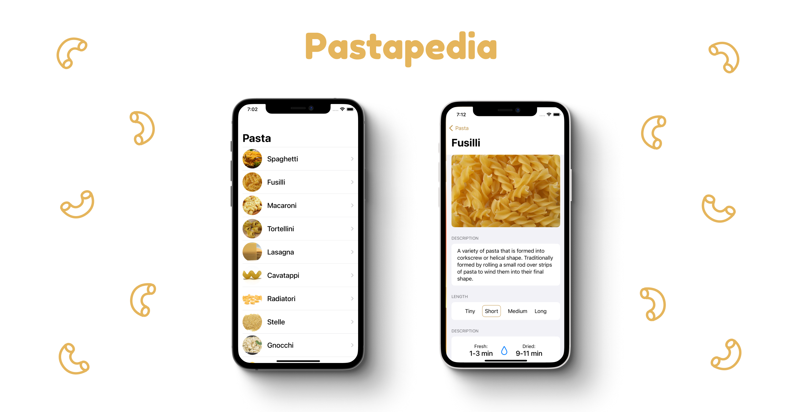

Pastapedia is a SwiftUI app to do nothing more than show you the amazing variety of pasta in this world*.

\* But also mostly my experiment in building my first SwiftUI app. Its basic, but I plan on interating along the way.

### Installation

There are two ways your can try this application:

**Building from source:**

You can clone this project on GitHub and run the associated `.xcodeproj` file.

**Beta test with Testflight**

Email tinycactusapps@gmail.com with the subject title "Pastapedia beta test request" to request a TestFlight invitation.

**App Store**

_Coming soon._

### Upcoming features

I'll probably build up on this along the way, but I have some thoughts around possibly adding:

* Searching
* Filtering
* Favoriting
* WatchOS support
* Widget support
* MacOS support

But if you have other suggestions, email tinycactusapps@gmail.com - I'll let my mind stew on any new ideas.